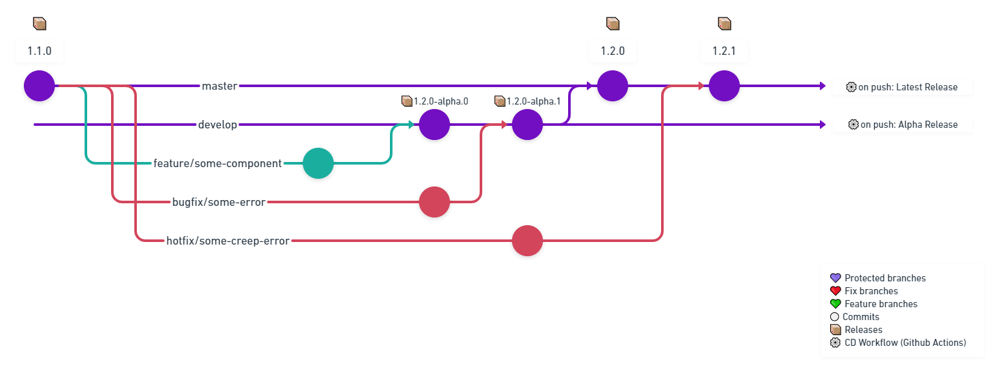

# Contributing

Thanks for your interest in contributing to the Solar Components 🎉!


## Developing
Clone this repository and run.
```bash
npm install
npm start
```

Follow [Stencil docs](https://stenciljs.com/docs/my-first-component) to create your component.

This project is structured based on the [Atomic Design](http://atomicdesign.bradfrost.com/), taking advantage of it modularity approach.

## Development Guidelines
* **Naming:** All components should start with `ac` prefix;
* **Styling:** Don't use `:slotted` CSS selector, because it not works properly in Edge and it breaks the rules of Atomic Design.

### Community Best Practices
Consider follow these documentations to contribute in this repo:
- [Custom Element Best Practices](https://developers.google.com/web/fundamentals/web-components/best-practices)
- [Guidelines for creating web platform compatible components](https://w3ctag.github.io/webcomponents-design-guidelines/)
- [The Gold Standard Checklist for Web Components](https://github.com/webcomponents/gold-standard/wiki)
- [Stencil Style Guide](https://stenciljs.com/docs/style-guide)

### Useful links
- [Open WebComponents](https://open-wc.org/)
- [Atomic Design](http://atomicdesign.bradfrost.com/)

## Git Flow & CI/CD


- All works must start from the latest version of the `master` branch;
- Each branch must be prefixed with one type: `feature`, `bugfix`, `hotfix`, `chore` or `refactor`;
- To publish a work, the owner must create a PR for the target branch:
    - All PR's must target the `develop` branch, except `hotfix` branches, that must target the `master` branch directly;
    - The PR must be reviewed by one main contributor at least;
    - If the reviewer identifies that some code needs to be improved, he should point out the code section using the Github review tool;
    - When the reviewer approves the work, the branch must be merged with the `Squash & Merge` method, and deleted;
- When a work merges into `develop`, the [`Publish Alpha`](workflows/alpha.yml) workflow runs and publish a alpha release to NPM;
- All accumulated works at `develop` branch must be centralized on a PR targeting the `master` branch;
    - The PR must pass in a manual test, executed by one main contributor, to be approved;
    - If it fails, the merged work that affect it must be reverted and restored;
        - As an alternative, a branch can be created from the `develop` branch, to fix it integrity;
    - If it pass, the PR must be merged using the `Merge` method, to keep the commit history;
- When a work merges into `master`, the [`Publish Latest`](workflows/latest.yml) workflow runs. It bumps the package version and tag it, generates CHANGELOG files and publish a latest release to NPM;

## Commit Message Format

We have very precise rules over how our git commit messages should be formatted. This leads to readable messages that are easy to follow when looking through the project history. We also use the git commit messages to generate our changelog. (Ok you got us, it's basically Angular's commit message format).
Check out more info at [Conventional Commits](https://www.conventionalcommits.org/en/v1.0.0/)
```
type(scope): subject
<body>
<footer>
```

#### Type
Must be one of the following:

* **feat**: A new feature
* **fix**: A bug fix
* **docs**: Documentation only changes
* **style**: Changes that do not affect the meaning of the code (white-space, formatting, missing semi-colons, etc)
* **refactor**: A code change that neither fixes a bug nor adds a feature
* **perf**: A code change that improves performance
* **test**: Adding missing tests
* **chore**: Changes to the build process or auxiliary tools and libraries such as documentation generation

#### Scope
The scope is used to provide additional contextual information that the commit applies. Usually, we use the target folder name for it, as if it was a module of the project.

#### Subject
The subject contains succinct description of the change:

* use the imperative, present tense: "change" not "changed" nor "changes"
* do not capitalize first letter
* do not place a period `.` at the end
* entire length of the commit message must not go over 50 characters
* describe what the commit does, not what issue it relates to or fixes
* **be brief, yet descriptive** - we should have a good understanding of what the commit does by reading the subject

Also you can include a body to describe what was made, it's useful to explain a big logic choice.

#### Footer
The footer is useful to reference or close a target issue.
```
feat(ac-button): add fill property

closes #40
```
**Remember that all commits that affect the usage of the package drastically, like API changes, must be signed with a BREAKING CHANGE footer:**
```
feat(ac-button): apply the new design specification

BREAKING CHANGE:

The `fill` property was removed in favor of the `type` property. [Chekout the docs](/core/src/components/ac-button)
```

## Creating an Issue
> TODO: Create issue conventions
### Naming convention

## Creating a Pull Request
> TODO: Create PR conventions
### Naming convention

## License

By contributing your code to the accera-tech/solar-components GitHub Repository, you agree to license your contribution under the MIT license.