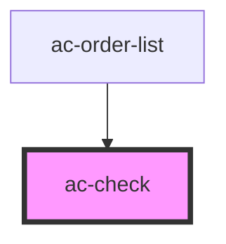

# ac-check

<!-- Auto Generated Below -->

## Properties

| Property            | Attribute             | Description                            | Type                                                                                                                                   | Default                       |
| ------------------- | --------------------- | -------------------------------------- | -------------------------------------------------------------------------------------------------------------------------------------- | ----------------------------- |
| `checked`           | `checked`             | The actual checked state.              | `boolean`                                                                                                                              | `undefined`                   |
| `direction`         | `direction`           | Set the label direction.               | `"left" \| "right"`                                                                                                                    | `'right'`                     |
| `disabled`          | `disabled`            | The native disabled mode.              | `boolean`                                                                                                                              | `undefined`                   |
| `error`             | `error`               | Error state and message of this field. | `string`                                                                                                                               | `undefined`                   |
| `formFieldBehavior` | `form-field-behavior` | The FormFieldBehavior instance.        | `any`                                                                                                                                  | `new FormFieldBehavior(this)` |
| `helperText`        | `helper-text`         | The helper text to guide the user.     | `string`                                                                                                                               | `undefined`                   |
| `label`             | `label`               | The textual label of this field.       | `string`                                                                                                                               | `undefined`                   |
| `name`              | `name`                | The HTML field name.                   | `string`                                                                                                                               | `undefined`                   |
| `required`          | `required`            | Mark this field as required.           | `boolean`                                                                                                                              | `undefined`                   |
| `type`              | `type`                | The type of this field.                | `"checkbox" \| "radio"`                                                                                                                | `'checkbox'`                  |
| `validator`         | --                    | Validation pipeline for this field.    | `((value: any, field: FormFieldBehavior, form: FormBehavior) => CustomValidityState \| Promise<CustomValidityState>) \| ValidatorFn[]` | `undefined`                   |
| `validity`          | --                    | The validity state.                    | `{ [x: string]: boolean \| { message?: string; }; }`                                                                                   | `undefined`                   |
| `value`             | `value`               | The HTML field value.                  | `string`                                                                                                                               | `undefined`                   |

## Methods

### `getFormFieldBehavior() => Promise<any>`

Used to provide access to the FormField instance.

#### Returns

Type: `Promise<any>`

### `getNativeFormField() => Promise<HTMLInputElement>`

#### Returns

Type: `Promise<HTMLInputElement>`

## Dependencies

### Used by

 - [ac-order-list](../../molecules/ac-order-list)

### Graph

----------------------------------------------

*Built with [StencilJS](https://stenciljs.com/)*
