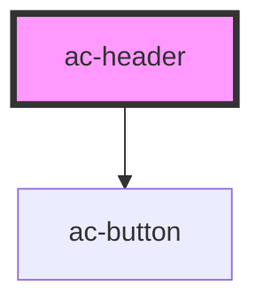

# ac-header

<!-- Auto Generated Below -->

## Properties

| Property   | Attribute  | Description | Type      | Default     |
| ---------- | ---------- | ----------- | --------- | ----------- |
| `scrolled` | `scrolled` |             | `boolean` | `undefined` |
| `theme`    | `theme`    |             | `string`  | `'primary'` |

## Dependencies

### Depends on

- [ac-button](../ac-button)

### Graph

----------------------------------------------

*Built with [StencilJS](https://stenciljs.com/)*
