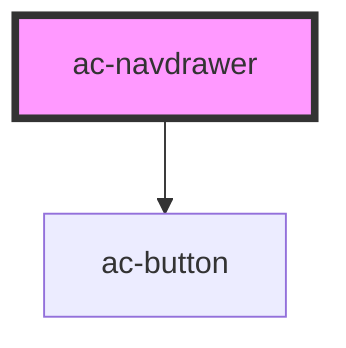

# ac-navdrawer

<!-- Auto Generated Below -->

## Properties

| Property     | Attribute     | Description                                   | Type      | Default     |
| ------------ | ------------- | --------------------------------------------- | --------- | ----------- |
| `compact`    | `compact`     | Compact mode.                                 | `boolean` | `undefined` |
| `showToggle` | `show-toggle` | Show or hide toggle button                    | `boolean` | `true`      |
| `theme`      | `theme`       | The color theme.                              | `string`  | `undefined` |
| `title`      | `title`       | Show title in the navdrawer and toggle header | `string`  | `undefined` |

## Events

| Event   | Description | Type                |
| ------- | ----------- | ------------------- |
| `close` |             | `CustomEvent<void>` |

## Dependencies

### Depends on

- [ac-button](../ac-button)

### Graph

----------------------------------------------

*Built with [StencilJS](https://stenciljs.com/)*
