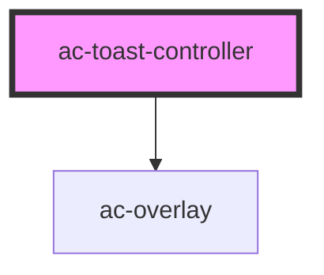

# ac-toast-controller

<!-- Auto Generated Below -->

## Properties

| Property | Attribute | Description                                                                                   | Type     | Default     |
| -------- | --------- | --------------------------------------------------------------------------------------------- | -------- | ----------- |
| `bound`  | `bound`   | An optional property used to refer the parent element that the component will be attached to. | `string` | `undefined` |

## Methods

### `create(props: ControllerComponentOptions<AcToast>) => Promise<any>`

Set properties to the managed component.

#### Returns

Type: `Promise<any>`

### `dismiss(data: any) => Promise<any>`

Clear properties of the managed component.

#### Returns

Type: `Promise<any>`

## Dependencies

### Depends on

- [ac-overlay](../../../portals/ac-overlay)

### Graph

----------------------------------------------

*Built with [StencilJS](https://stenciljs.com/)*
