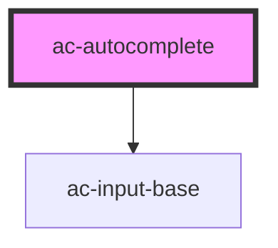

# ac-autocomplete

<!-- Auto Generated Below -->

## Properties

| Property         | Attribute          | Description                                      | Type                                                                                                                                   | Default            |
| ---------------- | ------------------ | ------------------------------------------------ | -------------------------------------------------------------------------------------------------------------------------------------- | ------------------ |
| `disabled`       | `disabled`         | Set the disabled mode.                           | `boolean`                                                                                                                              | `undefined`        |
| `error`          | `error`            | Set the field in the error state with a message. | `boolean \| string`                                                                                                                    | `undefined`        |
| `fetch`          | --                 | Action to be call when the user start typing.    | `(params: { filter: string; }) => Promise<AsyncMetadata<AcOption<{}>[]>>`                                                              | `undefined`        |
| `label`          | `label`            | The label text of the input.                     | `string`                                                                                                                               | `undefined`        |
| `loading`        | `loading`          | Set the loading mode, showing a loading icon.    | `boolean`                                                                                                                              | `undefined`        |
| `name`           | `name`             | The name of the internal input.                  | `string`                                                                                                                               | `undefined`        |
| `noResultsLabel` | `no-results-label` | Set the custom empty result text.                | `string`                                                                                                                               | `'No results for'` |
| `options`        | --                 | The options that will be displayed in the panel. | `AcOption<{}>[]`                                                                                                                       | `[]`               |
| `required`       | `required`         | The native required attribute.                   | `boolean`                                                                                                                              | `undefined`        |
| `size`           | `size`             | Select size                                      | `"large" \| "small"`                                                                                                                   | `undefined`        |
| `validator`      | --                 | The validator functions.                         | `((value: any, field: FormFieldBehavior, form: FormBehavior) => CustomValidityState \| Promise<CustomValidityState>) \| ValidatorFn[]` | `undefined`        |
| `validity`       | --                 | The validity state.                              | `{ [x: string]: boolean \| { message?: string; }; }`                                                                                   | `undefined`        |
| `value`          | `value`            | The value of the input.                          | `any`                                                                                                                                  | `undefined`        |

## Events

| Event          | Description                           | Type               |
| -------------- | ------------------------------------- | ------------------ |
| `selectChange` | Fired when the user select an option. | `CustomEvent<any>` |

## Methods

### `getFormFieldBehavior() => Promise<FormFieldBehavior>`

Used to provide access to the FormField instance.

#### Returns

Type: `Promise<FormFieldBehavior>`

## Dependencies

### Depends on

- [ac-input-base](../../atoms/ac-input-base)

### Graph

----------------------------------------------

*Built with [StencilJS](https://stenciljs.com/)*
