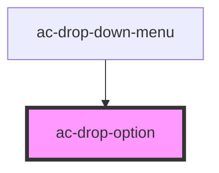

# ac-drop-tem

<!-- Auto Generated Below -->

## Properties

| Property           | Attribute           | Description                         | Type      | Default     |
| ------------------ | ------------------- | ----------------------------------- | --------- | ----------- |
| `image`            | `image`             | Image to be display in the left.    | `string`  | `undefined` |
| `imageDescription` | `image-description` | (Optional) Image description.       | `string`  | `undefined` |
| `label`            | `label`             | Label to be display.                | `string`  | `undefined` |
| `selected`         | `selected`          | Flag that mark the selected option. | `boolean` | `false`     |
| `value`            | `value`             | Value of the option.                | `string`  | `undefined` |

## Dependencies

### Used by

 - [ac-drop-down-menu]()

### Graph

----------------------------------------------

*Built with [StencilJS](https://stenciljs.com/)*
