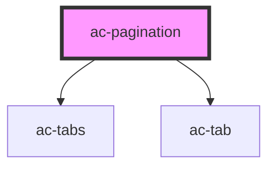

# ac-pagination

<!-- Auto Generated Below -->

## Properties

| Property        | Attribute        | Description                                 | Type     | Default      |
| --------------- | ---------------- | ------------------------------------------- | -------- | ------------ |
| `nextLabel`     | `next-label`     | Used to localize the Next button label.     | `string` | `'Next'`     |
| `previousLabel` | `previous-label` | Used to localize the Previous button label. | `string` | `'Previous'` |
| `selected`      | `selected`       | The selected page.                          | `number` | `1`          |
| `totalPages`    | `total-pages`    | The amount of pages.                        | `number` | `undefined`  |

## Events

| Event              | Description                    | Type               |
| ------------------ | ------------------------------ | ------------------ |
| `paginationChange` | Event emitted when changed tab | `CustomEvent<any>` |

## Dependencies

### Depends on

- [ac-tabs](../ac-tabs)
- [ac-tab](../ac-tabs/ac-tab)

### Graph

----------------------------------------------

*Built with [StencilJS](https://stenciljs.com/)*
