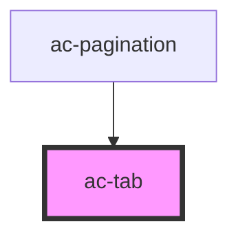

# ac-tab

<!-- Auto Generated Below -->

## Properties

| Property  | Attribute | Description                               | Type      | Default     |
| --------- | --------- | ----------------------------------------- | --------- | ----------- |
| `active`  | `active`  | If true, mark this tab as a selected tab. | `boolean` | `undefined` |
| `compact` | `compact` | Set this tab in compact mode.             | `boolean` | `undefined` |

## Dependencies

### Used by

 - [ac-pagination](../../ac-pagination)

### Graph

----------------------------------------------

*Built with [StencilJS](https://stenciljs.com/)*
