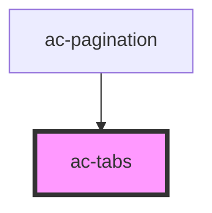

# ac-tabs

<!-- Auto Generated Below -->

## Properties

| Property   | Attribute  | Description                                                           | Type               | Default     |
| ---------- | ---------- | --------------------------------------------------------------------- | ------------------ | ----------- |
| `compact`  | `compact`  |                                                                       | `boolean`          | `undefined` |
| `selected` | `selected` |                                                                       | `number \| string` | `undefined` |
| `theme`    | `theme`    | The theme color defined in the color palette. The default is primary. | `string`           | `undefined` |

## Events

| Event       | Description | Type                  |
| ----------- | ----------- | --------------------- |
| `tabChange` |             | `CustomEvent<string>` |

## Dependencies

### Used by

 - [ac-pagination](../ac-pagination)

### Graph

----------------------------------------------

*Built with [StencilJS](https://stenciljs.com/)*
