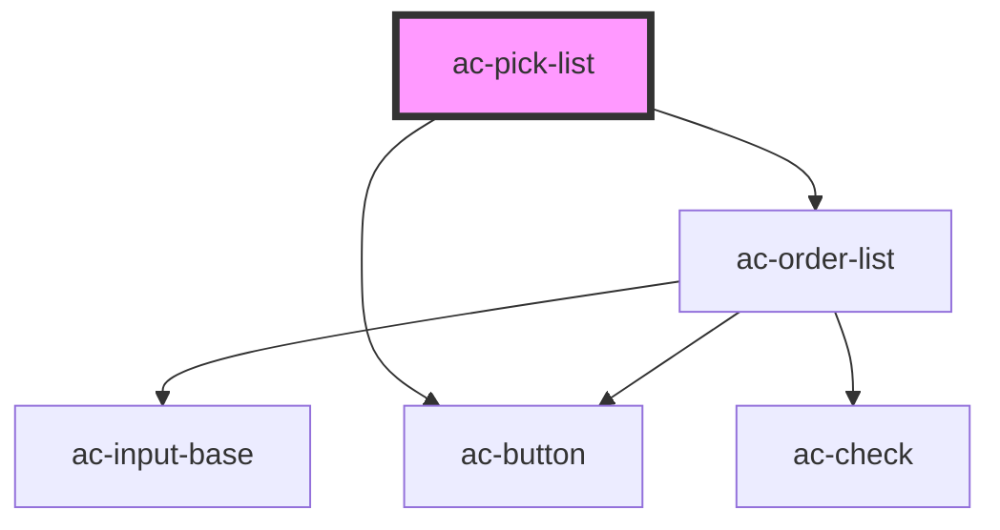

# ac-pick-list

<!-- Auto Generated Below -->

## Properties

| Property         | Attribute          | Description                                                           | Type             | Default        |
| ---------------- | ------------------ | --------------------------------------------------------------------- | ---------------- | -------------- |
| `addAllLabel`    | `add-all-label`    | Label of the button that add all options on the selected ac-list.     | `string`         | `'Add all'`    |
| `addLabel`       | `add-label`        | Label of the button that add options on the  selected ac-list.        | `string`         | `'Add'`        |
| `availableLabel` | `available-label`  | Label for ac-list of avalible options                                 | `string`         | `undefined`    |
| `noResultsLabel` | `no-results-label` | Label to be show when no results is fouond.                           | `string`         | `undefined`    |
| `options`        | --                 | List of all options available.                                        | `AcOption<{}>[]` | `undefined`    |
| `removeAllLabel` | `remove-all-label` | Label of the button that remove all options on the  selected ac-list. | `string`         | `'Remove All'` |
| `removeLabel`    | `remove-label`     | Label of the button that remove options on the on selected ac-list.   | `string`         | `'Remove'`     |
| `searchLabel`    | `search-label`     | Text to be search.                                                    | `string`         | `'Search'`     |
| `selectedLabel`  | `selected-label`   | Label for ac-list of selected options                                 | `string`         | `undefined`    |

## Methods

### `getSelectedOptions() => Promise<any>`

Return the selected items.

#### Returns

Type: `Promise<any>`

## Dependencies

### Depends on

- [ac-order-list](../../molecules/ac-order-list)
- [ac-button](../../atoms/ac-button)

### Graph

----------------------------------------------

*Built with [StencilJS](https://stenciljs.com/)*
