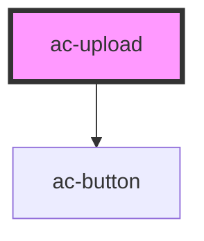

# ac-upload

<!-- Auto Generated Below -->

## Properties

| Property           | Attribute            | Description                                                           | Type       | Default     |
| ------------------ | -------------------- | --------------------------------------------------------------------- | ---------- | ----------- |
| `disabled`         | `disabled`           | Disabled upload files.                                                | `boolean`  | `false`     |
| `name`             | `name`               | The name to native input.                                             | `string`   | `undefined` |
| `theme`            | `theme`              | The theme color defined in the color palette. The default is primary. | `string`   | `'primary'` |
| `uploadButtonText` | `upload-button-text` | Text introduced in Button upload.                                     | `string`   | `undefined` |
| `value`            | --                   |                                                                       | `FileList` | `undefined` |

## Events

| Event        | Description                   | Type                    |
| ------------ | ----------------------------- | ----------------------- |
| `uploadFile` | Event when a file is dropped. | `CustomEvent<FileList>` |

## Methods

### `handleClick() => Promise<void>`

#### Returns

Type: `Promise<void>`

### `removeFiles() => Promise<void>`

#### Returns

Type: `Promise<void>`

## Dependencies

### Depends on

- [ac-button](../../atoms/ac-button)

### Graph

----------------------------------------------

*Built with [StencilJS](https://stenciljs.com/)*
