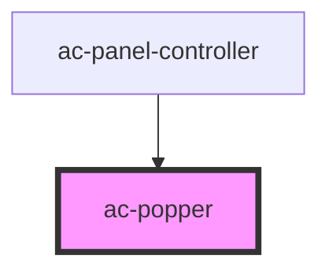

# ac-popper

<!-- Auto Generated Below -->

## Properties

| Property          | Attribute          | Description                                     | Type                                                                                                                                                                                                         | Default     |
| ----------------- | ------------------ | ----------------------------------------------- | ------------------------------------------------------------------------------------------------------------------------------------------------------------------------------------------------------------ | ----------- |
| `popperOptions`   | --                 | Popper.js's options.                            | `PopperOptions`                                                                                                                                                                                              | `undefined` |
| `popperPivot`     | `popper-pivot`     | Pivot element used to place the popper.         | `HTMLElement \| string`                                                                                                                                                                                      | `undefined` |
| `popperPlacement` | `popper-placement` | Popper.js's placement.                          | `"auto" \| "auto-end" \| "auto-start" \| "bottom" \| "bottom-end" \| "bottom-start" \| "left" \| "left-end" \| "left-start" \| "right" \| "right-end" \| "right-start" \| "top" \| "top-end" \| "top-start"` | `undefined` |
| `vchildren`       | `vchildren`        | Used to pass the custom children to the portal. | `any`                                                                                                                                                                                                        | `undefined` |

## Dependencies

### Used by

 - [ac-panel-controller](../../organisms/ac-panel/ac-panel-controller)

### Graph

----------------------------------------------

*Built with [StencilJS](https://stenciljs.com/)*
