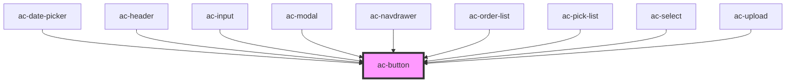

# ac-button

<!-- Auto Generated Below -->

## Properties

| Property   | Attribute   | Description                                                                                                        | Type                              | Default     |
| ---------- | ----------- | ------------------------------------------------------------------------------------------------------------------ | --------------------------------- | ----------- |
| `disabled` | `disabled`  | The HTML5 native disable prop.                                                                                     | `boolean`                         | `undefined` |
| `expand`   | `expand`    | Button width.                                                                                                      | `"block"`                         | `undefined` |
| `fill`     | `fill`      | Fill mode: * flat - No borders and no raising * solid - Raised button, default * clear - No background and borders | `"clear" \| "flat" \| "solid"`    | `'solid'`   |
| `href`     | `href`      | An optional link to open when click on it. Turns the button into a anchor element.                                 | `string`                          | `undefined` |
| `iconOnly` | `icon-only` | Icon only mode, with a square button, centered icon.                                                               | `boolean`                         | `undefined` |
| `loading`  | `loading`   | Set the loading mode, showing a loading icon.                                                                      | `boolean`                         | `undefined` |
| `shape`    | `shape`     | Button shape.                                                                                                      | `"round"`                         | `undefined` |
| `size`     | `size`      | The size of the button.                                                                                            | `"large" \| "small"`              | `undefined` |
| `target`   | `target`    | The HTML5 native anchor target to handle the href property.                                                        | `string`                          | `undefined` |
| `theme`    | `theme`     | The theme color defined in the color palette. The default is white.                                                | `any`                             | `undefined` |
| `type`     | `type`      | The HTML5 button type. See https://mdn.io/button                                                                   | `"button" \| "reset" \| "submit"` | `'button'`  |

## Dependencies

### Used by

 - [ac-date-picker](../ac-date-picker)
 - [ac-header](../ac-header)
 - [ac-input](../../molecules/ac-input)
 - [ac-modal](../../organisms/ac-modal)
 - [ac-navdrawer](../ac-navdrawer)
 - [ac-order-list](../../molecules/ac-order-list)
 - [ac-pick-list](../../organisms/ac-pick-list)
 - [ac-select](../../molecules/ac-select)
 - [ac-upload](../../organisms/ac-upload)

### Graph

----------------------------------------------

*Built with [StencilJS](https://stenciljs.com/)*
