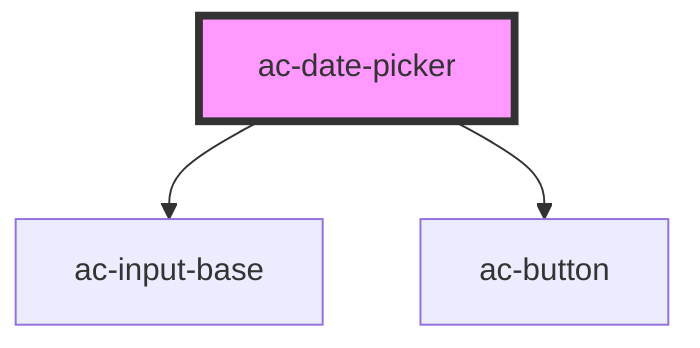

# ac-date-picker

<!-- Auto Generated Below -->

## Properties

| Property                    | Attribute                        | Description                                    | Type                                                                                                                                   | Default         |
| --------------------------- | -------------------------------- | ---------------------------------------------- | -------------------------------------------------------------------------------------------------------------------------------------- | --------------- |
| `altField`                  | `alt-field`                      |                                                | `string`                                                                                                                               | `''`            |
| `altFieldDateFormat`        | `alt-field-date-format`          |                                                | `string`                                                                                                                               | `'@'`           |
| `autoClose`                 | `auto-close`                     |                                                | `boolean`                                                                                                                              | `false`         |
| `classes`                   | `classes`                        |                                                | `string`                                                                                                                               | `''`            |
| `clearButton`               | `clear-button`                   |                                                | `boolean`                                                                                                                              | `false`         |
| `dateFormat`                | `date-format`                    |                                                | `string`                                                                                                                               | `''`            |
| `dateTimeSeparator`         | `date-time-separator`            |                                                | `string`                                                                                                                               | `' '`           |
| `disableNavWhenOutOfRange`  | `disable-nav-when-out-of-range`  |                                                | `boolean`                                                                                                                              | `true`          |
| `disabled`                  | `disabled`                       | If this field is in the disabled state.        | `boolean`                                                                                                                              | `undefined`     |
| `firstDay`                  | `first-day`                      |                                                | `string`                                                                                                                               | `''`            |
| `formattedValue`            | `formatted-value`                |                                                | `string`                                                                                                                               | `undefined`     |
| `hoursStep`                 | `hours-step`                     |                                                | `number`                                                                                                                               | `1`             |
| `inline`                    | `inline`                         |                                                | `boolean`                                                                                                                              | `false`         |
| `isShowing`                 | `is-showing`                     |                                                | `boolean`                                                                                                                              | `undefined`     |
| `keyboardNav`               | `keyboard-nav`                   |                                                | `boolean`                                                                                                                              | `true`          |
| `label`                     | `label`                          |                                                | `string`                                                                                                                               | `'Date'`        |
| `language`                  | `language`                       |                                                | `string`                                                                                                                               | `'en'`          |
| `maxDate`                   | `max-date`                       |                                                | `string`                                                                                                                               | `''`            |
| `maxHours`                  | `max-hours`                      |                                                | `number`                                                                                                                               | `24`            |
| `maxMinutes`                | `max-minutes`                    |                                                | `number`                                                                                                                               | `59`            |
| `minDate`                   | `min-date`                       |                                                | `string`                                                                                                                               | `''`            |
| `minHours`                  | `min-hours`                      |                                                | `number`                                                                                                                               | `0`             |
| `minMinutes`                | `min-minutes`                    |                                                | `number`                                                                                                                               | `0`             |
| `minView`                   | `min-view`                       |                                                | `string`                                                                                                                               | `'days'`        |
| `minutesStep`               | `minutes-step`                   |                                                | `number`                                                                                                                               | `1`             |
| `monthsField`               | `months-field`                   |                                                | `string`                                                                                                                               | `'monthsShort'` |
| `moveToOtherMonthsOnSelect` | `move-to-other-months-on-select` |                                                | `boolean`                                                                                                                              | `true`          |
| `moveToOtherYearsOnSelect`  | `move-to-other-years-on-select`  |                                                | `boolean`                                                                                                                              | `true`          |
| `multipleDates`             | `multiple-dates`                 |                                                | `boolean \| number`                                                                                                                    | `undefined`     |
| `multipleDatesSeparator`    | `multiple-dates-separator`       |                                                | `string`                                                                                                                               | `', '`          |
| `name`                      | `name`                           | The form field name.                           | `string`                                                                                                                               | `undefined`     |
| `offset`                    | `offset`                         |                                                | `number`                                                                                                                               | `12`            |
| `onlyTimepicker`            | `only-timepicker`                |                                                | `boolean`                                                                                                                              | `false`         |
| `position`                  | `position`                       |                                                | `string`                                                                                                                               | `'bottom left'` |
| `range`                     | `range`                          |                                                | `boolean`                                                                                                                              | `false`         |
| `required`                  | `required`                       | If this field component is required.           | `boolean`                                                                                                                              | `undefined`     |
| `selectOtherMonths`         | `select-other-months`            |                                                | `boolean`                                                                                                                              | `true`          |
| `selectOtherYears`          | `select-other-years`             |                                                | `boolean`                                                                                                                              | `true`          |
| `showEvent`                 | `show-event`                     |                                                | `string`                                                                                                                               | `'focus'`       |
| `showOtherMonths`           | `show-other-months`              |                                                | `boolean`                                                                                                                              | `true`          |
| `showOtherYears`            | `show-other-years`               |                                                | `boolean`                                                                                                                              | `true`          |
| `startDate`                 | --                               |                                                | `Date`                                                                                                                                 | `new Date()`    |
| `timeFormat`                | `time-format`                    |                                                | `string`                                                                                                                               | `''`            |
| `timepicker`                | `timepicker`                     |                                                | `boolean`                                                                                                                              | `false`         |
| `todayButton`               | `today-button`                   |                                                | `boolean`                                                                                                                              | `false`         |
| `toggleSelected`            | `toggle-selected`                |                                                | `boolean`                                                                                                                              | `true`          |
| `validator`                 | --                               | The validators that ensure the field validity. | `((value: any, field: FormFieldBehavior, form: FormBehavior) => CustomValidityState \| Promise<CustomValidityState>) \| ValidatorFn[]` | `undefined`     |
| `validity`                  | --                               | The validity state of the FormField.           | `{ [x: string]: boolean \| { message?: string; }; }`                                                                                   | `undefined`     |
| `value`                     | --                               | The field value of the component.              | `Date \| Date[]`                                                                                                                       | `undefined`     |
| `view`                      | `view`                           |                                                | `string`                                                                                                                               | `'days'`        |
| `weekends`                  | --                               |                                                | `number[]`                                                                                                                             | `[6, 0]`        |

## Events

| Event            | Description | Type               |
| ---------------- | ----------- | ------------------ |
| `onChangeDecade` |             | `CustomEvent<any>` |
| `onChangeMonth`  |             | `CustomEvent<any>` |
| `onChangeView`   |             | `CustomEvent<any>` |
| `onChangeYear`   |             | `CustomEvent<any>` |
| `onHide`         |             | `CustomEvent<any>` |
| `onRenderCell`   |             | `CustomEvent<any>` |
| `onSelect`       |             | `CustomEvent<any>` |
| `onShow`         |             | `CustomEvent<any>` |

## Methods

### `clear() => Promise<void>`

#### Returns

Type: `Promise<void>`

### `destroy() => Promise<void>`

#### Returns

Type: `Promise<void>`

### `getElement() => Promise<HTMLElement>`

#### Returns

Type: `Promise<HTMLElement>`

### `getFormFieldBehavior() => Promise<any>`

Used to provide access to the FormField instance.

#### Returns

Type: `Promise<any>`

### `getSelectedDates() => Promise<Date[]>`

#### Returns

Type: `Promise<Date[]>`

### `hide() => Promise<void>`

#### Returns

Type: `Promise<void>`

### `next() => Promise<void>`

#### Returns

Type: `Promise<void>`

### `prev() => Promise<void>`

#### Returns

Type: `Promise<void>`

### `removeDate(date: Date) => Promise<void>`

#### Returns

Type: `Promise<void>`

### `selectDate(date: Date) => Promise<void>`

#### Returns

Type: `Promise<void>`

### `setDate(date: Date) => Promise<void>`

#### Returns

Type: `Promise<void>`

### `setView(view: string) => Promise<void>`

#### Returns

Type: `Promise<void>`

### `update(field: string, value: any) => Promise<void>`

#### Returns

Type: `Promise<void>`

## Dependencies

### Depends on

- [ac-input-base](../ac-input-base)
- [ac-button](../ac-button)

### Graph

----------------------------------------------

*Built with [StencilJS](https://stenciljs.com/)*
