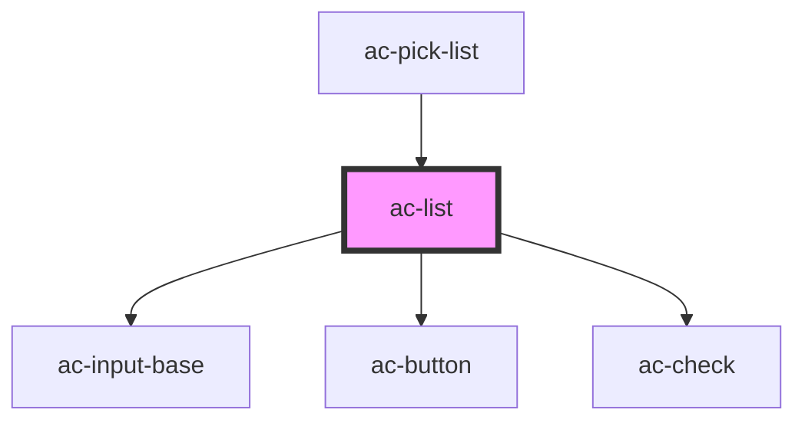

# ac-list

<!-- Auto Generated Below -->

## Properties

| Property         | Attribute          | Description                                                         | Type               | Default     |
| ---------------- | ------------------ | ------------------------------------------------------------------- | ------------------ | ----------- |
| `filterText`     | `filter-text`      |                                                                     | `string`           | `undefined` |
| `label`          | `label`            | Used to customize the field label                                   | `string`           | `undefined` |
| `multiple`       | `multiple`         | If true, the component will handle multiple selected items.         | `boolean`          | `false`     |
| `noResultsLabel` | `no-results-label` | Message that will be rendered with the search results in zero items | `string`           | `undefined` |
| `options`        | --                 | List of all options available.                                      | `ListOption<{}>[]` | `undefined` |
| `searchLabel`    | `search-label`     | Used to customize the searchbar's label                             | `string`           | `undefined` |

## Events

| Event        | Description                   | Type                  |
| ------------ | ----------------------------- | --------------------- |
| `listChange` | Event trigger on state change | `CustomEvent<AcList>` |

## Methods

### `getSelectedOptions() => Promise<ListOption<{}>[]>`

#### Returns

Type: `Promise<ListOption<{}>[]>`

## Dependencies

### Used by

 - [ac-pick-list](../../organisms/ac-pick-list)

### Depends on

- [ac-input-base](../../atoms/ac-input-base)
- [ac-button](../../atoms/ac-button)
- [ac-check](../../atoms/ac-check)

### Graph

----------------------------------------------

*Built with [StencilJS](https://stenciljs.com/)*
