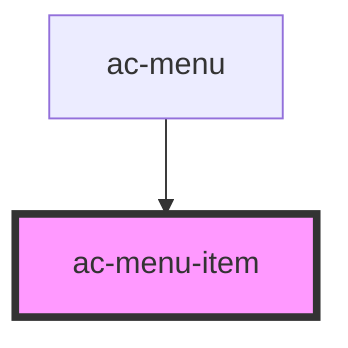

# ac-menu-item

<!-- Auto Generated Below -->

## Properties

| Property    | Attribute   | Description | Type      | Default     |
| ----------- | ----------- | ----------- | --------- | ----------- |
| `active`    | `active`    |             | `boolean` | `undefined` |
| `collapsed` | `collapsed` |             | `boolean` | `undefined` |
| `disabled`  | `disabled`  |             | `boolean` | `undefined` |
| `hidden`    | `hidden`    |             | `boolean` | `undefined` |
| `href`      | `href`      |             | `string`  | `undefined` |
| `iconOnly`  | `icon-only` |             | `boolean` | `undefined` |
| `submenu`   | `submenu`   |             | `boolean` | `undefined` |

## Dependencies

### Used by

 - [ac-menu](..)

### Graph

----------------------------------------------

*Built with [StencilJS](https://stenciljs.com/)*
