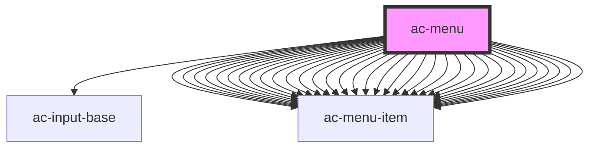

# ac-menu

<!-- Auto Generated Below -->

## Properties

| Property         | Attribute          | Description | Type               | Default     |
| ---------------- | ------------------ | ----------- | ------------------ | ----------- |
| `iconOnly`       | `icon-only`        |             | `boolean`          | `undefined` |
| `noResultsLabel` | `no-results-label` |             | `string`           | `undefined` |
| `searchLabel`    | `search-label`     |             | `string`           | `undefined` |
| `searchable`     | `searchable`       |             | `boolean`          | `undefined` |
| `selected`       | `selected`         |             | `number \| string` | `undefined` |

## Events

| Event        | Description | Type                  |
| ------------ | ----------- | --------------------- |
| `menuChange` |             | `CustomEvent<string>` |

## Dependencies

### Depends on

- [ac-input-base](../../atoms/ac-input-base)
- [ac-menu-item](ac-menu-item)
- [ac-menu-item](ac-menu-item)
- [ac-menu-item](ac-menu-item)
- [ac-menu-item](ac-menu-item)
- [ac-menu-item](ac-menu-item)
- [ac-menu-item](ac-menu-item)
- [ac-menu-item](ac-menu-item)
- [ac-menu-item](ac-menu-item)
- [ac-menu-item](ac-menu-item)
- [ac-menu-item](ac-menu-item)
- [ac-menu-item](ac-menu-item)
- [ac-menu-item](ac-menu-item)
- [ac-menu-item](ac-menu-item)
- [ac-menu-item](ac-menu-item)
- [ac-menu-item](ac-menu-item)
- [ac-menu-item](ac-menu-item)
- [ac-menu-item](ac-menu-item)
- [ac-menu-item](ac-menu-item)
- [ac-menu-item](ac-menu-item)
- [ac-menu-item](ac-menu-item)
- [ac-menu-item](ac-menu-item)
- [ac-menu-item](ac-menu-item)
- [ac-menu-item](ac-menu-item)
- [ac-menu-item](ac-menu-item)
- [ac-menu-item](ac-menu-item)
- [ac-menu-item](ac-menu-item)
- [ac-menu-item](ac-menu-item)
- [ac-menu-item](ac-menu-item)
- [ac-menu-item](ac-menu-item)
- [ac-menu-item](ac-menu-item)
- [ac-menu-item](ac-menu-item)
- [ac-menu-item](ac-menu-item)
- [ac-menu-item](ac-menu-item)

### Graph

----------------------------------------------

*Built with [StencilJS](https://stenciljs.com/)*
