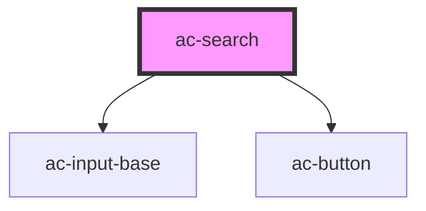

# ac-search

<!-- Auto Generated Below -->

## Properties

| Property      | Attribute      | Description | Type     | Default     |
| ------------- | -------------- | ----------- | -------- | ----------- |
| `fetch`       | `fetch`        |             | `any`    | `undefined` |
| `searchLabel` | `search-label` |             | `string` | `undefined` |
| `value`       | `value`        |             | `any`    | `undefined` |

## Dependencies

### Depends on

- [ac-input-base](../../atoms/ac-input-base)
- [ac-button](../../atoms/ac-button)

### Graph

----------------------------------------------

*Built with [StencilJS](https://stenciljs.com/)*
