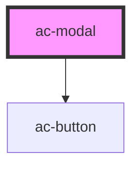

# ac-modal-controller

<!-- Auto Generated Below -->

## Properties

| Property | Attribute | Description                                    | Type     | Default     |
| -------- | --------- | ---------------------------------------------- | -------- | ----------- |
| `title`  | `title`   | The title that will be displayed on the modal. | `string` | `undefined` |

## Events

| Event   | Description                       | Type                |
| ------- | --------------------------------- | ------------------- |
| `close` | Dispatched when the modal closes. | `CustomEvent<void>` |

## Dependencies

### Depends on

- [ac-button](../../atoms/ac-button)

### Graph

----------------------------------------------

*Built with [StencilJS](https://stenciljs.com/)*
