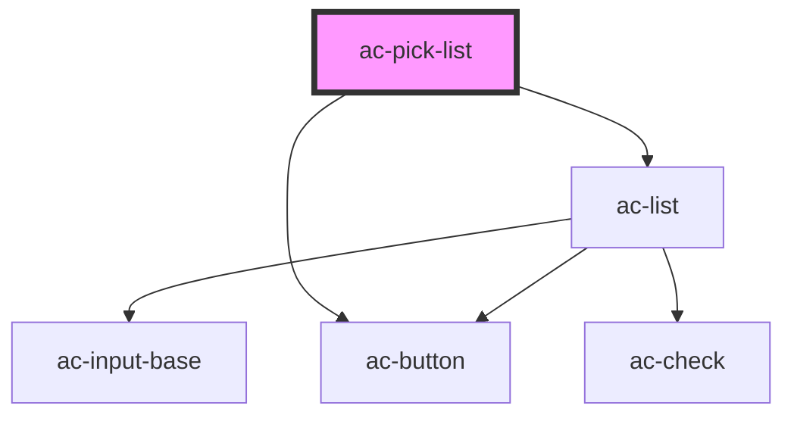

# ac-pick-list

<!-- Auto Generated Below -->

## Properties

| Property         | Attribute          | Description | Type               | Default        |
| ---------------- | ------------------ | ----------- | ------------------ | -------------- |
| `addAllLabel`    | `add-all-label`    |             | `string`           | `'Add all'`    |
| `addLabel`       | `add-label`        |             | `string`           | `'Add'`        |
| `availableLabel` | `available-label`  |             | `string`           | `undefined`    |
| `noResultsLabel` | `no-results-label` |             | `string`           | `undefined`    |
| `options`        | --                 |             | `ListOption<{}>[]` | `undefined`    |
| `removeAllLabel` | `remove-all-label` |             | `string`           | `'Remove All'` |
| `removeLabel`    | `remove-label`     |             | `string`           | `'Remove'`     |
| `searchLabel`    | `search-label`     |             | `string`           | `undefined`    |
| `selectedLabel`  | `selected-label`   |             | `string`           | `undefined`    |

## Dependencies

### Depends on

- [ac-list](../../molecules/ac-list)
- [ac-button](../../atoms/ac-button)

### Graph

----------------------------------------------

*Built with [StencilJS](https://stenciljs.com/)*
