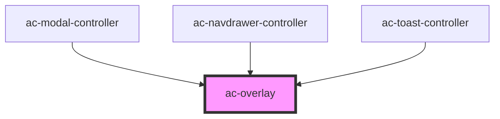

# ac-overlay

<!-- Auto Generated Below -->

## Properties

| Property       | Attribute       | Description                                     | Type                                                                                                                                                                            | Default           |
| -------------- | --------------- | ----------------------------------------------- | ------------------------------------------------------------------------------------------------------------------------------------------------------------------------------- | ----------------- |
| `backdrop`     | `backdrop`      | The backdrop theme.                             | `"dark" \| "light"`                                                                                                                                                             | `'dark'`          |
| `disableClose` | `disable-close` |                                                 | `boolean`                                                                                                                                                                       | `undefined`       |
| `noLayer`      | `no-layer`      |                                                 | `boolean`                                                                                                                                                                       | `undefined`       |
| `position`     | `position`      | Content position based on flex layout.          | `"center center" \| "center flex-end" \| "center start" \| "flex-end center" \| "flex-end flex-end" \| "flex-end start" \| "start center" \| "start flex-end" \| "start start"` | `'center center'` |
| `vchildren`    | `vchildren`     | Used to pass the custom children to the portal. | `any`                                                                                                                                                                           | `undefined`       |

## Events

| Event           | Description | Type                |
| --------------- | ----------- | ------------------- |
| `backDropClick` |             | `CustomEvent<void>` |

## Methods

### `handleBackDropClick() => Promise<void>`

#### Returns

Type: `Promise<void>`

## Dependencies

### Used by

 - [ac-modal-controller](../../organisms/ac-modal/ac-modal-controller)
 - [ac-navdrawer-controller](../../atoms/ac-navdrawer/ac-navdrawer-controller)
 - [ac-toast-controller](../../atoms/ac-toast/ac-toast-controller)

### Graph

----------------------------------------------

*Built with [StencilJS](https://stenciljs.com/)*
